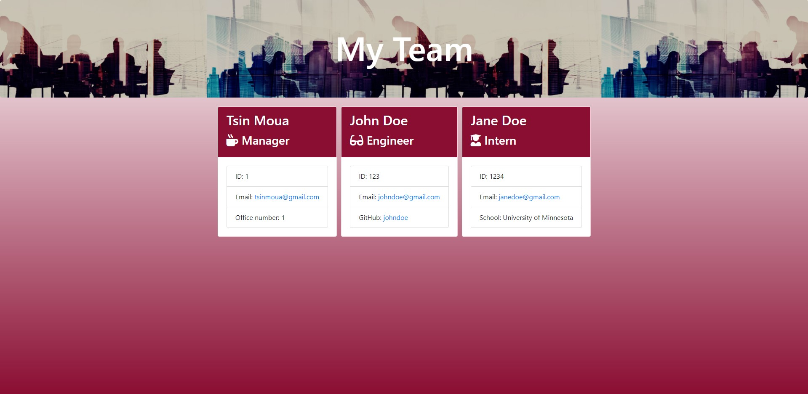

# Build Your Team


## Description 
This application will gather information about your employees and generate a webpage with their information. Based on their roles, you can access their email address and GitHub profile(if any).  
<!-- What was your motivation? Why did you build this project? (Note: The answer is not "Because it was a homework assignment.") What problem does it solve? What did you learn? What makes your project stand out? -->

## Table of Contents

* [Installation](#installation)
* [Test Instructions](#test%20instructions)
* [Usage Information](#usage%20information)
* [Contributions](#contributions)
* [License](#license)
* [Credits](#credits)
* [Questions](#questions)

## Installation
To install, run the following in your command line:
```
npm i
```
<!-- What are the steps required to install your project? Provide a step-by-step description of how to get the development environment running. -->

## Test Instructions
To test, run the following in your command line:
```
npm test
```
<!-- Go the extra mile and write tests for your application. Then provide examples on how to run them. -->

## Usage Information
To start, run the following in your command line:
```
node app.js
```

If you need more instructions on how to run this application, click [here](https://drive.google.com/file/d/1eTLv1tMj-E-Ic6eliH3CPWuRjX-6PGjt/view) for a short video tutorial


<!-- Provide instructions and examples for use. Include screenshots as needed.  -->

## Contributions
N/A
<!-- If you created an application or package and would like other developers to contribute it, you will want to add guidelines for how to do so. The [Contributor Covenant](https://www.contributor-covenant.org/) is an industry standard, but you can always write your own. -->

## License
This project is licensed under the MIT license.
<!-- The last section of a good README is a license. This lets other developers know what they can and cannot do with your project. If you need help choosing a license, use [https://choosealicense.com/](https://choosealicense.com/) -->

## Credits
N/A
<!-- List your collaborators, if any, with links to their GitHub profiles.
If you used any third-party assets that require attribution, list the creators with links to their primary web presence in this section.
If you followed tutorials, include links to those here as well. -->

## Questions
If you have any questions, please contact me at tsinmoua@gmail.com.  
You can find more of my work at https://github.com/tsinmoua

<!-- ## Badges


Badges aren't _necessary_, per se, but they demonstrate street cred. Badges let other developers know that you know what you're doing. Check out the badges hosted by [shields.io](https://shields.io/). You may not understand what they all represent now, but you will in time. -->

